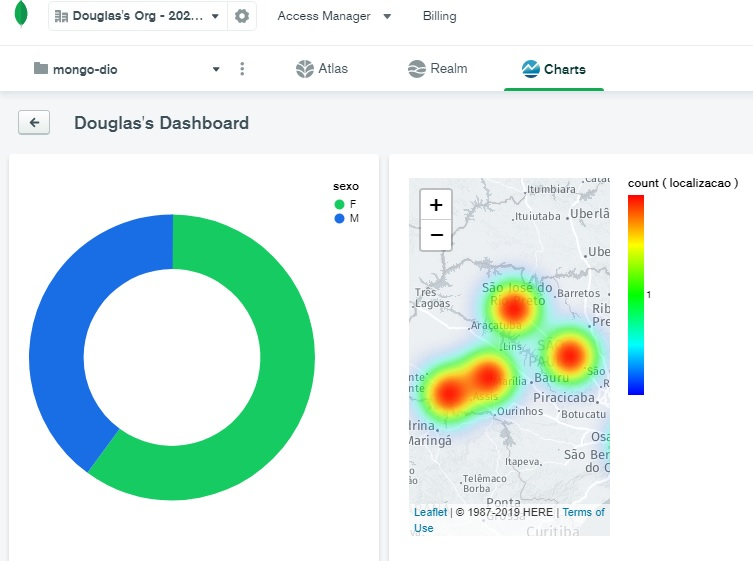

    <h1>Desenvolvimento de aplicações com .NET</h1>
    <h2><i>Projeto de uma API.NET integrada ao MongoDB.</i></h2>
    

    <h3>Este repositório é um projeto do Bootcamp .NET Developer - Digital Innovation One.</h3>
    
    <i>Desenvolvimento de aplicações com .NET</i>
 
    

    <b>Repositório de referência:</b> 
    
    

